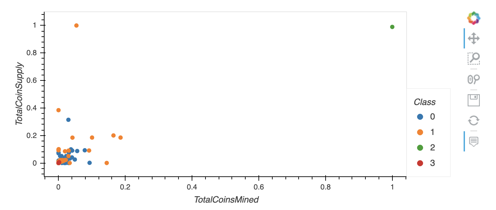

# Cryptocurrencies_Challenge

## Overview
This challenge demonstrates the use of Un-supervised Machine Learning Models to create data visualizations of what cryptocurrencies are on the trading market and how they could be grouped to create a classification system for this new investment

Following plots were generated after processing:

### 3D Scatter Plot

### hvplot Scatter Plot

